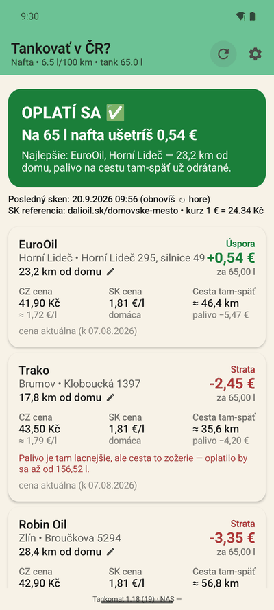
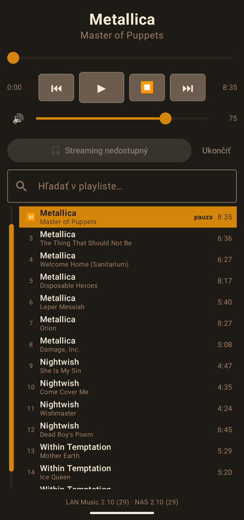
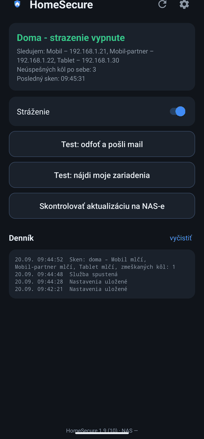
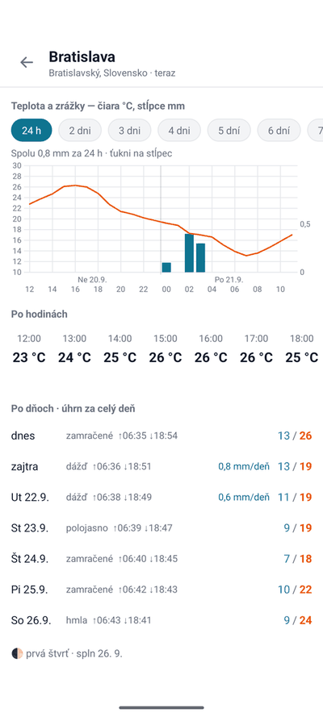
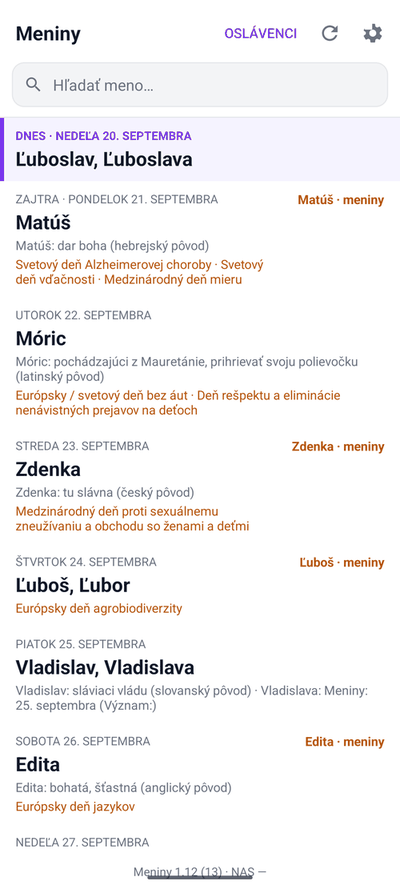
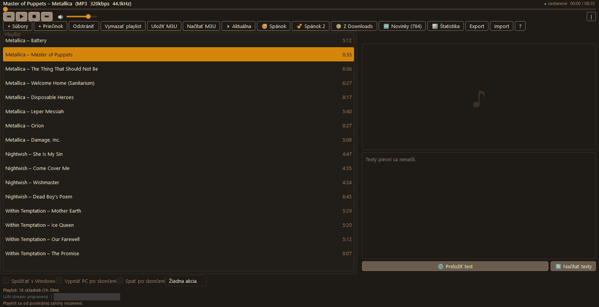

### Hi, I'm Michal

For about twenty years I was the IT guy — first for a regional forest office,
then fifteen years in a factory, later running Microsoft 365 for a research
company. Networks, servers, printers, users... basically everything that had
anything to do with technology ended up on my desk :)

Today I work as an MES consultant, bringing Industry 4.0 into manufacturing
plants in Slovakia — I sit with people in production, find out how they really
work, write it down for the developers and then test what comes back.

And at home I build my own tools. I am not a classic developer: I write down
what the thing should do and how I will know it works, AI coding agents write
the code, and I test it and use it every day — which is the best test there is.
When one of them breaks, the user and the helpdesk are the same person, so the
ticket is usually closed quite fast :)

## One year

I put my first projects here in August 2025. They are still here, archived, on
purpose — the difference is the point.

| August 2025 | September 2026 |
|---|---|
| [fuel-price](https://github.com/lukacmichal/fuel-price) — one Python script, prints the cheapest station to the console | [tankomat](https://github.com/lukacmichal/tankomat) — Android app, real road distances, subtracts the fuel burned on the way, 55 unit tests incl. saved copies of the scraped pages |
| [goal-checker](https://github.com/lukacmichal/goal-checker) — an Android app shown only as two screenshots | five Android apps with full source, one shared template and self-update from my own NAS instead of Google Play |
| [game-for-nephew](https://github.com/lukacmichal/game-for-nephew) — a maze game written in one evening | [hudba-lan](https://github.com/lukacmichal/hudba-lan) — PC music player + Android remote, LAN streaming, ~250 tests |
| no tests, files uploaded through the web | unit tests in almost every project, and the README says only what the code really does |

## Projects

| | |
|---|---|
| [**tankomat**](https://github.com/lukacmichal/tankomat) | Is it worth driving across the Czech border to fill up? Answers with a number. |
| [**hudba-lan**](https://github.com/lukacmichal/hudba-lan) | Music player that streams to the whole flat; the phone finds it by itself and puts the PC to sleep. |
| [**homesecure**](https://github.com/lukacmichal/homesecure) | An old phone guards the flat when none of my devices is on the Wi-Fi. |
| [**pocasie**](https://github.com/lukacmichal/pocasie) | Weather with alerts that downloads about 1.3 MB a month. |
| [**meniny**](https://github.com/lukacmichal/meniny) | Slovak name-day calendar with a widget and reminders. |

## What they look like

| [tankomat](https://github.com/lukacmichal/tankomat) | [hudba-lan](https://github.com/lukacmichal/hudba-lan) | [homesecure](https://github.com/lukacmichal/homesecure) | [pocasie](https://github.com/lukacmichal/pocasie) | [meniny](https://github.com/lukacmichal/meniny) |
|---|---|---|---|---|
|  |  |  |  |  |

And the other half of hudba-lan, the player on the PC:

Everything is in Slovak — I write these for myself and they never needed
another language. Every repository has more screenshots in its own README.

The Android apps share one written standard — same UI skeleton, same settings
layout, same way of updating themselves. It is in each repo as
`docs/shared-standard.md`.

**Tools:** Python · Kotlin · Jetpack Compose · Android widgets · PySide6 ·
ffmpeg · scraping · Windows automation · Synology NAS · AI coding agents

## And it does not end here

A year ago it was one script. Today it is apps I rely on every day. Next year
I hope this page looks as embarrassing as the 2025 projects look to me now —
that is the whole idea.

If you need something similar — an app, an automation, a tool that saves your
team a few hours a week — or you just want to talk about it,
**[write me a message here](https://github.com/lukacmichal/lukacmichal/issues/new?title=Hello%20Michal)**.
It lands straight in my inbox and I answer.
